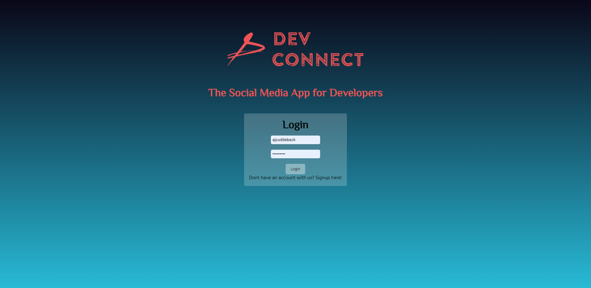

# Dev Connect V2

## Table of Contents:

- [Purpose](#purpose)
- [Technologies](Technologies)
- [Features](#features)
- [Website](#website)

## Purpose

- Dev Connect is an all-in-one platform for developers to meetup, ask questions, and connect with others.

## Technologies

- MERN
- MySQL
- Express
- React
- Node
- Bcrypt
- Styled-Components
- Sequelize

## Features

- Clean user interface
- Easy to use website
- Password encryption
- Search for groups within your area
- Shop for merch in our store!

## Website

[Deployed Dev Connect](https://dev-connect-v2.herokuapp.com/)

